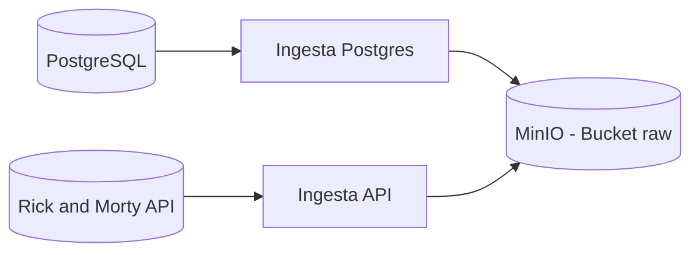

# Proyecto 1er Parcial – Ingesta Multi-Fuente hacia Data Lake (RAW)

---

## 1 Descripción

Este proyecto implementa un pipeline básico de ingeniería de datos que permite:

* Levantar infraestructura local con Docker
* Configurar un Data Lake en MinIO
* Ingerir datos desde múltiples fuentes
* Almacenar los datos sin transformar en la capa **RAW**

Se simula un entorno real donde los datos provienen tanto de una base relacional como de una API pública externa.

---

## 2️ Arquitectura



---

## 3️ Infraestructura

El entorno se levanta utilizando **Docker Compose**.

### Servicios incluidos:

* PostgreSQL
* MinIO

Ambos servicios:

* Son accesibles desde `localhost`
* Utilizan volúmenes para persistencia
* Se reconstruyen automáticamente si se eliminan los volúmenes

---

## 4️ Estructura del Proyecto

```
IngestionData/
│── docker-compose.yml
│── README.md
│
│
├── ingestion/
│   ├── postgres_to_raw.py
│   ├── external_to_raw.py
│   └── requirements.txt
```

## 5️ Verificación de funcionamiento de PostgreSQL

### 5.1 Verificar que el contenedor esté activo

Ejecutar en la terminal:

```bash
docker ps
```

Salida esperada similar a:

```
CONTAINER ID   NAME       IMAGE         STATUS
xxxxxx         postgres   postgres:15   Up ...
```

Si el estado es `Up`, PostgreSQL está corriendo correctamente.

---

### 5.2 Conectarse a PostgreSQL desde el contenedor

Ejecutar:

```bash
docker exec -it postgres psql -U de_user -d analytics
```

> Utilizar los valores definidos en el archivo `.env`.

Salida esperada:

```
analytics=#
```

Esto confirma:

* El servidor PostgreSQL está activo
* El usuario existe
* La base de datos fue creada
* La autenticación funciona correctamente

---

### 5.3 Verificar información básica del motor

Dentro del prompt `psql`, ejecutar:

```sql
SELECT version();
```

Esto confirma:

* La versión del motor
* Que PostgreSQL responde consultas correctamente

---

### 5.4 Probar persistencia del volumen (prueba crítica)

#### Crear tabla de prueba

```sql
CREATE TABLE test_connection (
    id SERIAL PRIMARY KEY,
    message TEXT
);
```

Insertar un registro:

```sql
INSERT INTO test_connection (message)
VALUES ('PostgreSQL funciona correctamente');
```

Consultar:

```sql
SELECT * FROM test_connection;
```

---

#### Reiniciar contenedores

Salir de PostgreSQL:

```sql
\q
```

Reiniciar servicios:

```bash
docker compose down
docker compose up -d
```

Volver a conectarse:

```bash
docker exec -it postgres psql -U de_user -d analytics
```

Consultar nuevamente:

```sql
SELECT * FROM test_connection;
```

Si el registro sigue presente → **el volumen está funcionando correctamente** y se garantiza la persistencia de datos.

---

## 6️ Fuente de Datos 1 – PostgreSQL

* Base de datos: `ingestion_db`
* Tabla: `test_connection`
* Tipo de ingesta: extracción completa
* Formato almacenado: CSV
* Ubicación en Data Lake:

```
raw/postgres/test_connection/test_connection_YYYYMMDD.csv
```

---

## 7️⃣ Fuente de Datos 2 – API Pública

Se utiliza la API pública de Banxico correspondiente a la **Serie histórica del tipo de cambio peso–dólar desde 1954** (ID: `SF63528`).

* Endpoint utilizado:  
  `https://www.banxico.org.mx/SieAPIRest/service/v1/series/SF63528/datos`

* Formato original: JSON  

* No se realiza transformación (capa RAW)

* Ubicación en Data Lake:

```
raw/external/banxico/banxico_usd_mxn_historico_YYYYMMDD.json
```

---

## 8️⃣ Variables de Entorno

Los scripts utilizan variables de entorno para:

* Conexión a PostgreSQL  
* Acceso a MinIO  
* Autenticación con la API de Banxico  

Ejemplo en `.env.example`:

```

POSTGRES_HOST=localhost
POSTGRES_PORT=5432
POSTGRES_DB=ingestion_db
POSTGRES_USER=postgres
POSTGRES_PASSWORD=postgres

BANXICO_TOKEN=TU_TOKEN_AQUI

MINIO_ENDPOINT=http://localhost:9000
MINIO_ACCESS_KEY=minioadmin
MINIO_SECRET_KEY=minioadmin
MINIO_BUCKET=raw
```
## 9️ Cómo Ejecutar el Proyecto

### 1️ Clonar repositorio

```bash
git clone <url-del-repo>
cd IngestionData
```

### 2️ Levantar infraestructura

```bash
docker-compose up -d
```

### 3️ Instalar dependencias

```bash
pip install -r ingestion/requirements.txt
```

### 4️ Ejecutar scripts de ingesta

```bash
python ingestion/postgres_to_raw.py
python ingestion/external_to_raw.py
```

---

##  Verificación en MinIO

Acceder a:

```
http://localhost:9001
```

Credenciales por defecto:

```
Usuario: minioadmin
Password: minioadmin
```

Dentro del bucket `raw` deben existir:

* Carpeta `postgres/`
* Carpeta `external/`
* Archivos con fecha actual


